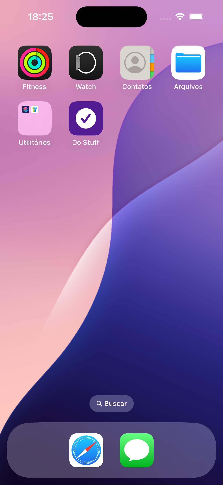
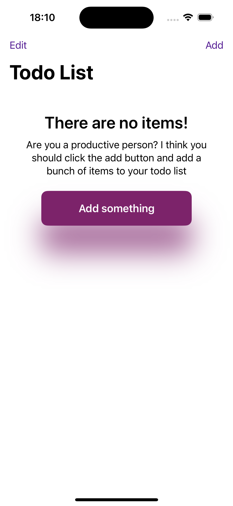
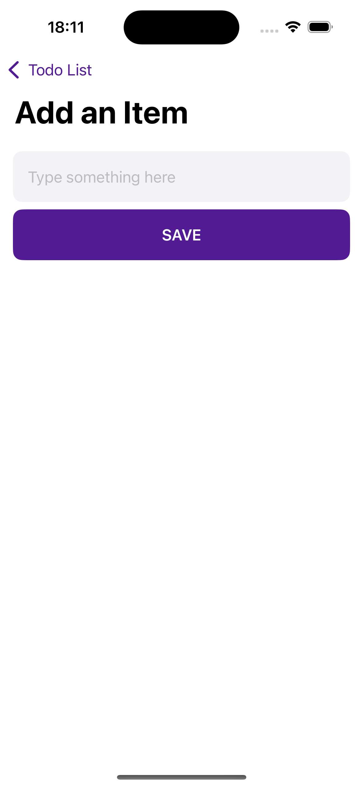
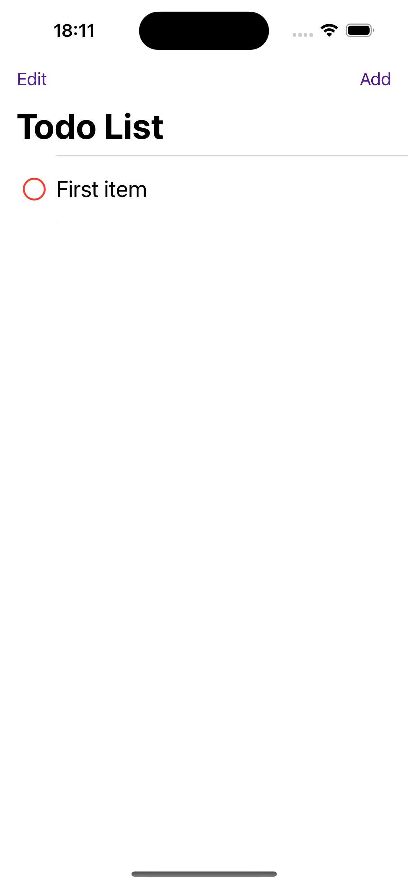
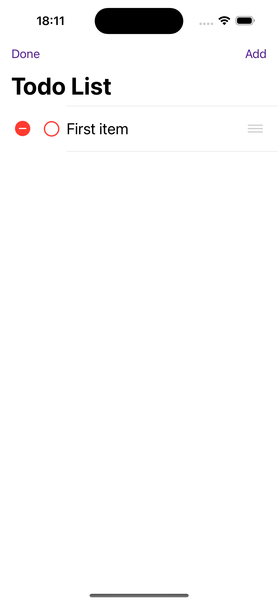
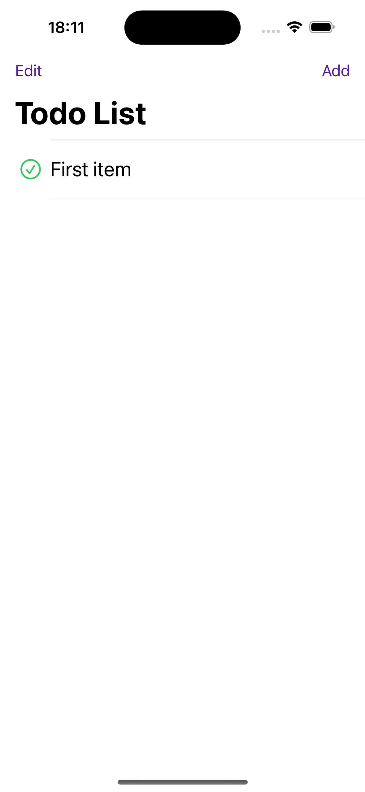

# SwiftUI-ToDo
> Projeto para prática do SwiftUI.

## Recursos Utilizados

* Arquitetura MVVM
* UserDefaults

* @EnvironmentObject notation
* @State notation

## Snapshots

  
 

 
  

  
 

 
  

 
  

 
  
 
